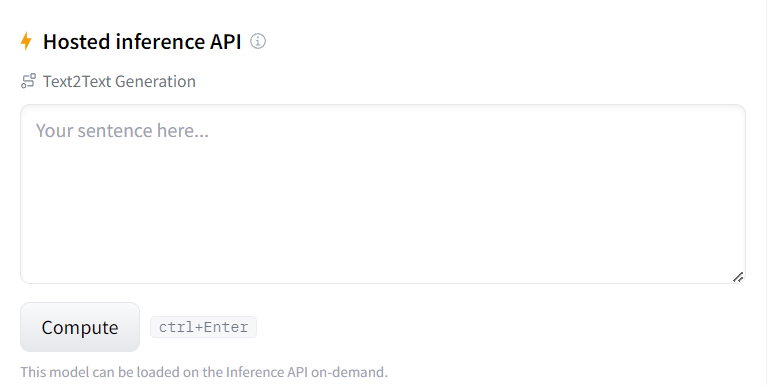

# Indian Legal Rights and Constitutional Information using Fine-Tuned LLMs

This repository contains fine-tuned versions of the "Falcon-Sharded-7B" and "GPT-Neox-20B" language models, tailored to provide answers in simple terms for questions related to constitutional rights and legalities in India. These models can help users understand complex legal concepts and rights in a more accessible way.

## Getting Started

To get started with using the fine-tuned models for Indian legal rights and constitutional information, you have two options for building and running the models themselves:

1. **Local Machine with GPU:**

   If you have a local machine with a GPU that has a computational power of at least 16GB of memory, you can set up and run the models locally.

2. **Free Google Colab with T4 GPU:**

   Alternatively, you can run the models on Google Colab using a free T4 GPU. This option is especially useful if you don't have a powerful GPU on your local machine.

## Testing the Model

To test the model on your local machine, you can use the provided testing script located at [Tests/test.py](https://github.com/NeoZ666/constitution-LLM/blob/main/Tests/test.py).

### Testing Dependencies

Before running the testing script, make sure you have the required dependencies installed:

```bash
!pip install -Uqqq pip
!pip install -qqq -U git+https://github.com/huggingface/transformers.git@e03a9cc
!pip install -qqq -U git+https://github.com/huggingface/peft.git@42a184f
!pip install -qqq -U git+https://github.com/huggingface/accelerate.git@c9fbb71
```

## Examples



## License

OpenRAIL
#### About this license

The Responsible AI License allows users to take advantage of the model in a wide range of settings (including free use and redistribution) as long as they respect the specific use case restrictions outlined, which correspond to model applications the licensor deems ill-suited for the model or are likely to cause harm.[Read More](https://huggingface.co/blog/open_rail)

---
